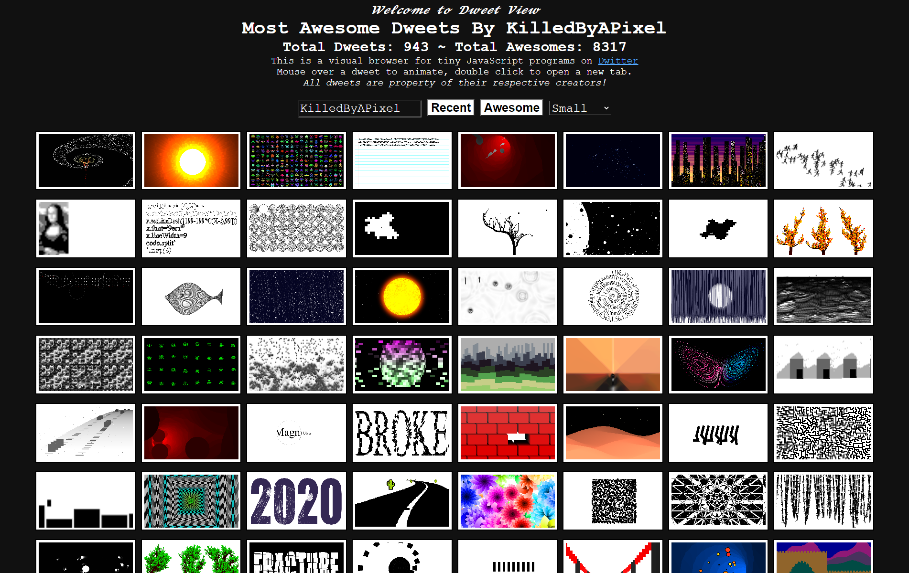

# Dweet View

A visual browser for [Dwitter](https://www.dwitter.net), the site for tiny JavaScript programs that fit in 140 characters.

## How to use

- Mouse over a dweet to animate it and see its code, info and comments
- Click a dweet to put its author in the username box
- Double click a dweet to open it by itself in a new tab, with a link you can share
- Double click it there to open it on Dwitter
- Enter a username and press *Recent* or *Awesome* to see their dweets
- Leave the username blank to see dweets by everyone
- Scroll down to load more

## Links

Every view has a link you can share.

| Link | Shows |
| --- | --- |
| `?user=NAME` | Most recent dweets by a user |
| `?user=NAME&awesome=1` | Most awesome dweets by a user |
| `?awesome=1` | Most awesome dweets by everyone |
| `?d=ID` | A single dweet |

## How it works

Dweet View is a single HTML file with no dependencies and no build step. It gets dweets from the public Dwitter API, so any static web server can host it.

Each dweet runs in its own sandboxed iframe, so dweet code can not touch the page. The page and the dweets talk using messages. Only dweets near the screen are kept loaded, and only the dweet under the mouse is animated.

To search through every dweet, try [The Dweetabase](https://dweetabase.3d2k.com).

## License

Dweet View is MIT licensed. All dweets are property of their respective creators!
